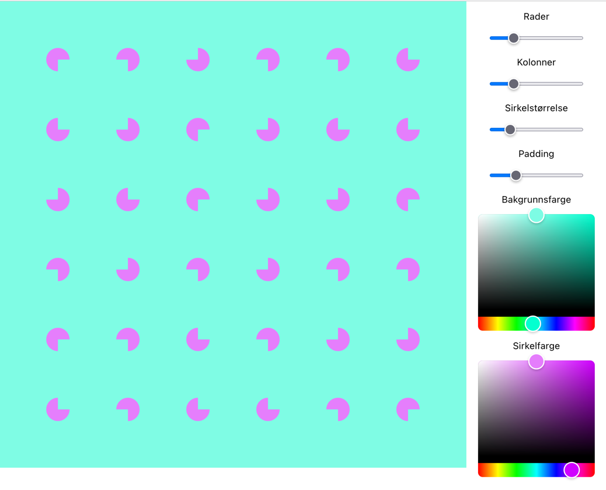
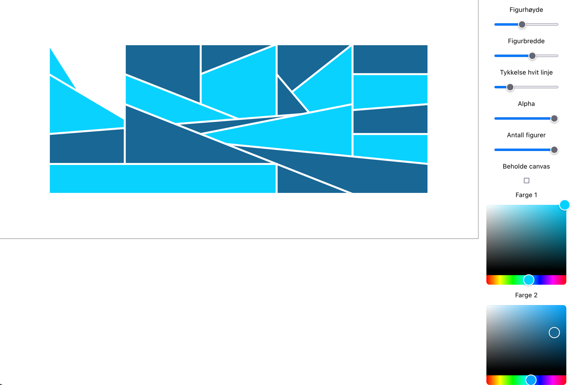

# Generative art workshop

You can solve the exercises either in the playground for p5.js at [https://editor.p5js.org
](https://editor.p5js.org/) or by running this repo. The pro of this repo is that it's easy to send parameters to p5, in
case
you want to introduce variables such as sliders to adjust your sketches.

This repo is a boilerplate (create-react-app with Typescript, react-p5, and some other handy stuff) and a couple
exercises
and resources for getting started with generative art.

### Setup

```
npm i
```

### Running

```
npm start
```

## Contents

- [Resources](#resources)
- [Exercises](#exercises)
- [Community](#community)
- [Credits and inspiration](#credits-and-inspiration)

## Resources

- Cheat sheet: https://bmoren.github.io/p5js-cheat-sheet/
- API docs: https://p5js.org/reference/

## Exercises

### Ex 1: Circle design

1. Fill the background with a colour
2. Create an evenly spaced grid across the page
3. At each point in the grid, draw a 75%-filled pie chart shape at 0º, 90º, 180º or 270º rotation

Example result:


### Ex 2: Sol LeWitt Inspired Wall Drawing

1. Using a 6x6 grid of evenly spaced points
1. Connect two random points on the grid; forming a trapezoid with two parallel sides extending down to the baseline
    1. Set the same stroke color as your background
    1. Fill the trapezoid with a colour
    1. Repeat until all grid points are exhausted
1. Layer the shapes by the average Y position of their two grid points so that the shortest shapes is drawn in front of
   the others

Example result:


## Community

- https://github.com/terkelg/awesome-creative-coding

## Credits and inspiration

- https://github.com/mattdesl/workshop-generative-art
- https://dev.to/aspittel/intro-to-generative-art-2hi7
- https://github.com/erdavids/Generative-Art
- Anders Hoff: https://inconvergent.net/
